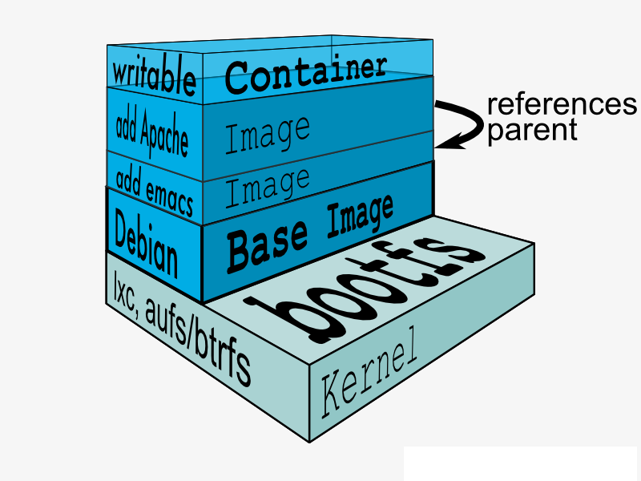

# Usage Of Docker

## TODO
- 看懂student-info的Dockerfile。
- 看懂Jenkins的Console Output的Docker部分。
- 了解基本的Docker命令。
- 在镜像命令加参数创建linux用户。
- docker的缓存。
- 数据卷（数据库镜像）。

## 概念
Docker是一个开源的应用**容器引擎**，开发者可以 **打包应用和依赖包（运行环境）** 到一个可移植的镜像中， 然后发布到任何一个Linux或者Windows上。容器之间是独立的沙盒机制，相互之间没有任何接口。

### 三个基本概念
- **镜像(Image)**：Docker镜像是用于创建Docker容器的模板，比如Ubuntu系统。
- **容器(Container)**：镜像和容器的关系就像**类和实例的关系**，镜像是静态的定义，容器是镜像运行的实体。容器可以被创建、启动、停止、删除等。（镜像 = className，容器 = new className）。
- **仓库(Repository)**：代码控制中心，用来保存镜像。

### 分层结构

在Dockerfile中的每一行命令，都在Docker镜像层中以一个独立镜像层的形式存在，因此减少镜像层是一个优化镜像提及的好方法。
镜像层最底层为最基础的系统镜像，然后是Dockerfile的命令形成的层，然后是容器的初始层，最后最顶层是容器所在的可读写层。
```bash
# 查看历史镜像结构
docker history ubuntu
```

### 数据卷
数据卷是存在宿主机上的为容器提供数据的东西，容器之间可以共用一个数据卷，一个容器可以绑定多个数据卷，在每次删除容器之后，数据卷也不会随之删除。
```bash
# 宿主机目录作为数据卷
docker run -v $PWD/data:/data -it ubuntu /bin/bash
# 创建数据卷容器
docker run -d -v /data-catalogue-name --name data-container mongo
# 数据卷容器作为数据卷
docker run --volumes-from data-container ubuntu /bin/bash
```

## 容器和虚拟机的区别
- 虚拟机如VMware之类需要模拟整台机器包括硬件环境，每台虚拟机都有完整的操作系统，一旦将资源预分配给虚拟机，那么这些资源将全部被占用；而容器不是模拟一个完整的操作系统，而是对进程进行隔离。（Hypervisor：虚拟机监视器（英语：virtual machine monitor，缩写为 VMM），是用来创建与运行虚拟机的软件、固件或硬件。）

- Docker 将应用程序与该程序的依赖，打包在一个文件里面。运行这个文件，就会生成一个虚拟容器。程序在这个虚拟容器里运行，就好像在真实的物理机上运行一样。有了 Docker ，就不用担心环境问题。
- 容器还可以进行版本管理、复制、分享、修改，就像管理普通的代码一样。

### 优点
- 秒级别启动。
- 操作系统级别虚拟化，容器和内核交互，几乎无性能损耗。
- 更轻量，各镜像共用一个内核与共享应用程序库，所占内存小。
- 占用硬盘一般为MB，而虚拟机GB级别。
- 高可用性，可快速重新部署。
- 分钟级别虚拟化创建，秒级别容器创建。
- Dockerfile记录容器构建过程，可在集群中实现快速分发和部署。
- 持续集成性高，通过编辑Dockerfile文件自动拉取代码、编译构建、运行测试、结果记录、测试统计。

### 缺点
- 隔离性较弱，Docker属于进程间的隔离，虚拟机属于系统级别的隔离。
- 安全性较弱，一旦容器内的用户提升为root，它就直接具备了宿主机的root权限。

## 应用场景
- web应用的自动化打包 和发布。
- 自动化测试和持续集成、发布。
- 在服务型环境中部署和调整数据库或其他后台应用。
- 从头编译或者扩展现有的OpenShift或者CloudFoundry平台来搭建自己的PaaS环境。

## Dockerfile
见Dockerfile文件示例。

### Docker的缓存机制
构建镜像使用build命令时，Docker会从上至下执行命令，这个过程中Docker会在其缓存中查找现有的中间镜像，如果在第N行命令之前的镜像中有可重用的缓存镜像，那么Docker会使用其缓存而不会重新生成第N行之前的镜像，第N行开始之后的镜像则会重新生成。

而ADD和COPY命令则是进行比较其文件内容是否更改，如果更改，那么从此行命令开始的所有命令都将重新生成镜像。

## 使用Docker的基本步骤
### 1. 下载镜像
```bash
# 查看已下载的镜像
docker images
# 在https://hub.docker.com/搜索镜像
docker search ubuntu
# 下载一个最新版本的Ubuntu镜像，如果想选择版本，那么镜像名写ubuntu:16.04。
docker pull ubuntu
# 删除镜像
docker rmi ubuntu
```
### 2. 创建镜像
  编写Dockerfile，根据一个基础镜像定制一个你想要的系统环境镜像，语法：`docker build [OPTIONS] PATH | URL | -`
  ```bash
  # 构建一个镜像名为ubuntu，标签名为test的镜像，-t是-tag的意思。
  docker build -t ubuntu:test .
  # -f 是指定文件名为dev.Dockerfile的Dockerfile来构建镜像。
  docker build -t ubuntu:dev -f dev.Dockerfile .
  # --build-arg是Dockerfile文件里的ARG，见lbk-crm.Dockerfile。
  docker docker build -t ubuntu:staging --build-arg QN_AKEY=**** .
  ```
  上面的命令有个`.`，这是个什么鬼？？？它指的是本次执行的上下文路径，可以指定Dockerfile 的绝对路径，由于docker的运行模式是 C/S。我们本机是 C，docker 引擎是 S。实际的构建过程是在docker引擎下完成的，所以这个时候无法用到我们本机的文件，比如我们想copy文件到镜像系统里。这就需要把我们本机的指定目录下的文件一起打包提供给 docker 引擎使用。如果未说明最后一个参数，那么默认上下文路径就是 Dockerfile 所在的位置。

### 3. 运行容器
  - 创建容器
    ```bash
    # 创建
    docker run -t -i ubuntu:latest /bin/bash
    # 创建后后台运行-d
    docker run -itd ubuntu /bin/bash
    # 查看所有容器
    docker ps -a
    # 退出容器终端
    exit
    # 查看运行中的容器
    docker ps
    ```
    参数说明：
    - -t：终端。
    - -i：交互式操作。
    - ubuntu:latest：Ubuntu镜像最新版本。
    - /bin/bash：镜像系统可执行的命令。在这里这个命令是交互式Shell。
  - 启动容器
    ```bash
    # 启动已停止的容器
    docker start <Container ID/NAME>
    # 重启容器
    docker restart <Container ID/NAME>
    ```
  - 停止容器
    ```bash
    # 停止运行中的容器
    docker stop <Container ID/NAME>
    ```
  - 进入容器
    ```bash
    # 退出容器会停止容器：docker attach [OPTIONS] CONTAINER
    docker attach <Container ID>
    # 退出容器不会停止容器
    docker exec -it <Container> /bin/bash
    ```
  - 删除容器
    ```bash
    # 删除指定容器
    docker rm -f <Container ID>
    # 清除所有终止状态的容器
    docker container prune
    ```
  - 运行web应用
    ```bash
    # 运行容器并暴露内部端口至随机端口
    docker run -d -P docker-test
    # 运行容器并暴露内部端口至指定端口
    docker run -d -p 32768:3000 docker-test
    # 查看内部输出日志
    docker logs -f <Container ID/NAME>
    # 查看内部运行进程
    docker top <Container ID>
    ```

### 相关命令
#### 镜像清理
  有时候由于调试代码产生很多的none的image，挨个清理会有些麻烦，下面是全部清理的命令：
  ```bash
  # 列出所有容器ID
  docker ps -aq
  # 停止所有容器
  docker stop $(docker ps -aq)
  docker ps -a | grep "Exited" | awk '{print $1 }'|xargs docker stop
  # 删除所有停止的容器
  docker ps -a | grep "Exited" | awk '{print $1 }'|xargs docker rm
  # 删除所有容器
  docker rmi $(docker ps -aq)
  # 删除所有tag标签是none的镜像
  docker images|grep none|awk '{print $3 }'|xargs docker rmi
  ```

## 参考
- [菜鸟教程](https://www.runoob.com/docker/docker-tutorial.html)
- [这可能是最为详细的Docker入门吐血总结](https://blog.csdn.net/deng624796905/article/details/86493330)
- [Docker与VM虚拟机的区别以及Docker的特点](https://blog.csdn.net/jingzhunbiancheng/article/details/80994909)
- [ubuntu下安装nodejs](https://blog.csdn.net/jinyu421/article/details/81453948)