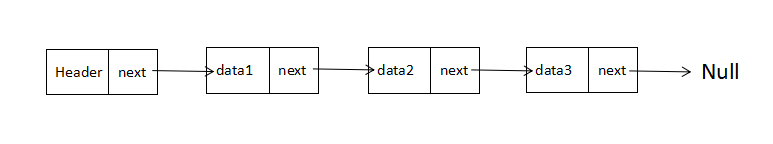

# 两数相加
看标题似乎很简单呢，不就是两个数字相加吗，傻子都会了，但实际上它偏偏在你题目里穿插另一个概念`链表`。
## 题目
> 给出两个 非空 的链表用来表示两个非负的整数。其中，它们各自的位数是按照 逆序 的方式存储的，并且它们的每个节点只能存储 一位 数字。
> 
> 如果，我们将这两个数相加起来，则会返回一个新的链表来表示它们的和。
> 
> 您可以假设除了数字 0 之外，这两个数都不会以 0 开头。

## 示例
> **输入**：(2 -> 4 -> 3) + (5 -> 6 -> 4)
> **输出**：7 -> 0 -> 8
> **原因**：342 + 465 = 807

## 解析
### 基础知识
- 链表

  `链表`是一组节点组成的集合，每个节点都使用一个对象的引用来指向它的后一个节点。指向另一节点的引用叫做链。下面是一个简单结构图，便于理解：
  

  其中，data保存数据，next保存下一个链表的引用。
  所以链表的结构是这样的：
  ```typescript
  const data3 = {
    value: 3,
    next: null,
  }
  const data2 = {
    value: 4,
    next: data3,
  }
  const data1 = {
    value: 2,
    next: data2,
  }
  ```
- 引用类型

  引用类型在赋值给变量时，变量保存的是引用类型在内存中的引用地址而非这个值。

### 思路
然后就有了一个思路，通过定义临时变量来保存接下来要使用的`ListNode`，每次循环都将`next`赋值给临时变量，那么只要`val`有值，那么循环就会一直进行下去.

又因为JavaScript的对象是一个引用类型数据，所以我们根据这个特性将两个`val`的和的`ListNode`保存在我们结果值的临时变量里，每次循环都将一个空`ListNode`赋值给这个临时变量，那么只要判断的条件为true，循环就会一直进行下去，我们所需要的结果的`next`也会一直延伸下去~最终得出一个新的链表！

### 上代码
```typescript
class ListNode {
  val:number;
  next?:ListNode;
  constructor(val:number) {
    this.val = val;
    this.next = null;
  }
}
const getNumber = () => Math.floor(Math.random()*10);
/**
 * 
 * @param l1 
 * @param l2 
 * @description 核心函数
 */
function addTwoNumbers(l1:ListNode, l2:ListNode) {
  const defaultLN = new ListNode(null);
  // 保存结果值的next
  let result = new ListNode(null)
  let resultTemp = result;
  // 保存当前要取的val
  let l1Temp = l1;
  let l2Temp = l2;
  // 是否需要进位
  let carry = false;
  while(isNumber(l1Temp.val) || isNumber(l2Temp.val)) {
    const { val:val1 , next:next1 } = l1Temp;
    const { val:val2 , next:next2 } = l2Temp;
    let amount = (val1 ? val1 : 0) + (val2 ? val2 : 0);
    if (carry) {
      amount += 1;
    }
    /** 相加结果是否是两位数 */
    carry = amount > 9
    resultTemp.val = carry ? +(amount.toString().substring(1)) : amount;
    // 如果当前的链表还有next，将next赋值给两个临时变量，将新的链表赋值给结果值变量，将临时变量替换为这个新建的链表。
    if (next1 || next2) {
      l1Temp = next1 ? next1 :defaultLN;
      l2Temp = next2 ? next2 : defaultLN;
      resultTemp.next = new ListNode(null);
      resultTemp = resultTemp.next;
    } else {
      carry && (resultTemp.next = new ListNode(1));
      break;
    }
  }
  return result;
}
/**
* 辅助测试
*/
const isNumber = (resultTemp:any) => typeof resultTemp === 'number';
/**
 * 
 * @param depth 
 * @description 生成一个`depth`深度的随机数链表
 */
const listNodeGenerator = (depth:number) => {
  let i = 0;
  let data:ListNode = null;
  while(i < depth) {
    i += 1;
    const temp = new ListNode(getNumber());
    temp.next = data;
    data = temp;
  }
  return data;
}
const l1 = listNodeGenerator(3);
const l2 = listNodeGenerator(2);
console.log(addTwoNumbers(l1, l2))
```

## 总结
一开始扣扯了半天也没有做出来，因为当时没有想到使用临时变量和while循环的判断条件，在码了一个多月的业务代码之后忽然想起来这道题还没做完，再次敲键盘解决问题的时候就豁然开朗，这样想想业务代码对人的成长帮助还是有一些的。

## 参考
- [JS中的算法与数据结构——链表(Linked-list)](https://www.jianshu.com/p/f254ec665e57)
- [两数相加-LeeCode](https://leetcode-cn.com/problems/add-two-numbers/)
